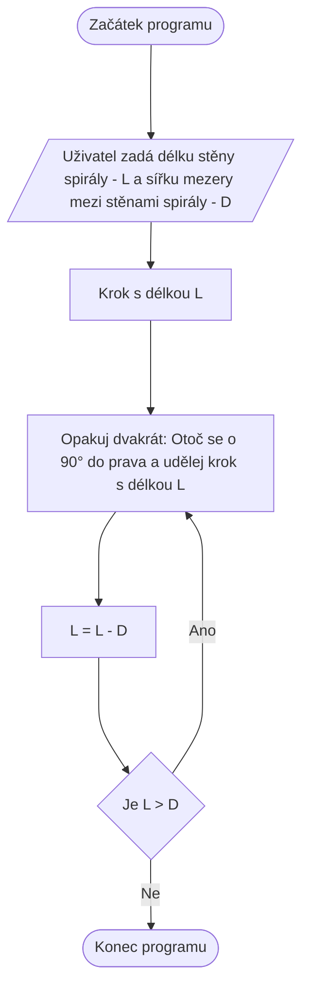

# Spirála


Obsahuje 2 verze:
- [loop.py - Používá smyčku při generování spirály.](loop.py)
- [recursion.py - Používá rekurzi při generování spirály.](recursion.py)

Defaultně, zadaná délka stěny není stejná jako počet znaků použitých při jejím vykreslení.
Počet znaků = zadaná délka stěny * zadaná šířka mezery mezi stěnami * 3. Díky tomu se předejde určitým chybám.
Toto chování se dá jednosuše změnit pomocí:
```diff
- S = L*D*3
+ S = L
```

## Alternativní Algoritmus

Nejjednodušší algoritmus, nefunguje v konzoli jen s GUI programy/frameworky s podporou [turtle](https://en.wikipedia.org/wiki/Turtle_graphics):

